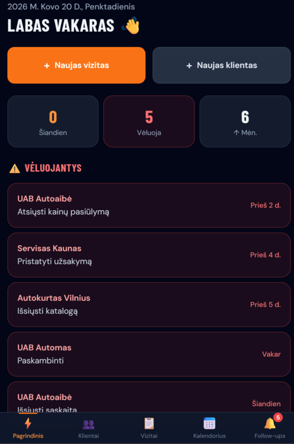
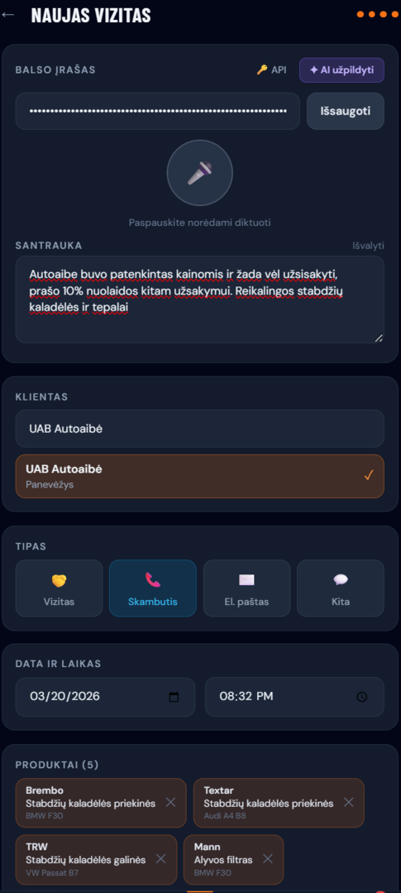
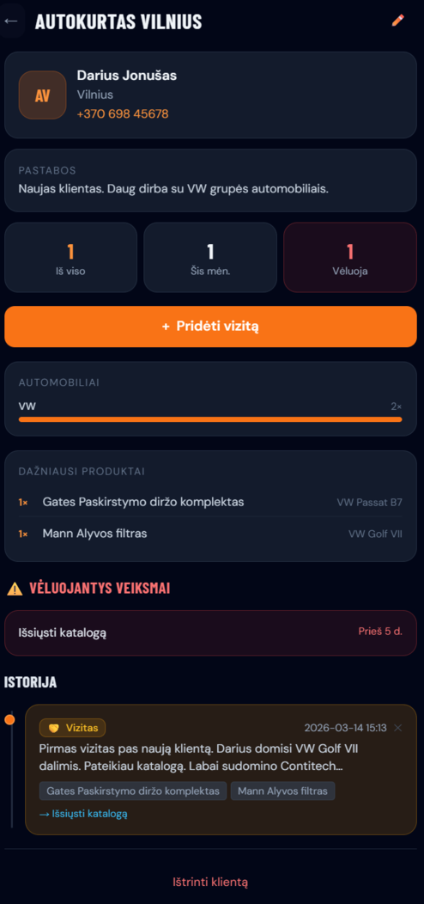
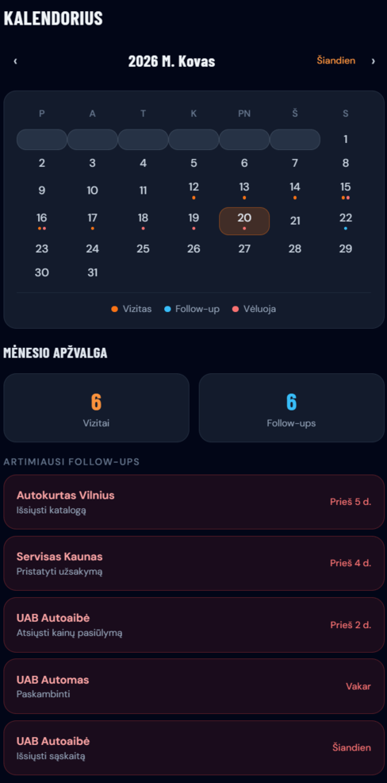

# AutoTrack ⚡
### AI-powered field sales tracker for auto parts representatives

> Log a client visit in under 20 seconds. Speak — AI fills the rest.

<!-- 📸 SCREENSHOT: Full app dashboard on mobile (dark UI, orange accents) -->


**[Live Demo →](https://second-sales-track.vercel.app/)** &nbsp;|&nbsp; Built with React + Vite + Tailwind + Claude AI

---

## The Problem: Field Sales Reps Are Invisible

There are hundreds of thousands of field sales representatives across Europe selling auto parts, industrial supplies, food & beverage, and pharmaceuticals. They drive routes, visit 8–12 clients a day, carry catalogues, negotiate deals — and then go home and try to remember what they promised to whom.

The tools built for them are either:

- **Too heavy** — Salesforce, HubSpot, Pipedrive. Built for office-based teams. Mobile experience is an afterthought. Require IT setup, admin training, company-wide rollout.
- **Too generic** — Notes apps, WhatsApp groups, spreadsheets. No structure, no follow-up tracking, no product data.
- **Not built for the moment** — Logging a visit while standing in a car park, hands cold, between two client stops, is painful with any existing tool.

The result: most field reps log nothing, or log it hours later from memory. Managers have no visibility. Follow-ups get missed. Revenue leaks.

---

## The Market Opportunity

| Segment | Size |
|---|---|
| Auto parts wholesale distributors in EU | ~45,000 companies |
| Field sales reps in auto parts (EU) | ~180,000 people |
| SMB distributors with 2–20 reps (no CRM) | ~35,000 companies |
| Avg revenue per SMB distributor | €2M–€15M/year |

The sweet spot is **small and mid-size auto parts distributors** (10–200 employees) who:
- Have field reps visiting workshops and garages daily
- Cannot afford or justify enterprise CRM
- Lose deals because follow-ups fall through the cracks
- Have no data on which products move at which clients

This segment is **massively underserved**. Existing niche tools (e.g. Tactile CRM, RepZio) are US-centric, English-only, and still require significant setup overhead.

**AutoTrack is built specifically for this gap** — mobile-first, voice-first, under 20 seconds to log a visit, zero onboarding friction.

---

## Solution: Log It While You're Still There

AutoTrack is a **progressive web app** that a sales rep opens on their phone the moment they walk out of a client. They tap record, speak naturally in their language, tap stop — and AI parses the transcript into a structured interaction log: client matched, products identified, follow-up date set.

No typing. No forms. No laptop.

<!-- 📸 SCREENSHOT: NewInteraction page with voice recorder active (red pulsing button) and AI fill button highlighted -->


---

## Features

### ⚡ Voice-First Interaction Logging
- One-tap voice dictation directly in the browser (no app install)
- Auto-restarts after silence pauses — speak naturally, take pauses
- Transcript appears in real time
- Works in Lithuanian (and any language supported by browser Speech API)

### ✦ AI-Powered Form Fill
- Press one button after dictating — Claude AI parses the transcript
- Automatically matches the **client** from your list
- Identifies **products** mentioned (by name, brand, or vehicle model)
- Extracts the **next action** and calculates the **deadline date** from natural language ("tomorrow", "next Friday")
- Detects interaction type (visit, call, email)

<!-- 📸 SCREENSHOT: Form filled by AI — client selected, products added, next action and date set -->


### 👥 Client Management
- Full client profiles with company, contact, city, phone, notes
- Interaction history timeline
- **Vehicle profile chart** — which car brands come up most at this client
- Top products discussed
- One-tap call from client profile

<!-- 📸 SCREENSHOT: ClientDetail page showing timeline + vehicle profile bar chart -->


### 🔔 Follow-Up Tracking
- Every interaction can have a next action + deadline
- Overdue items surface in red across the whole app — dashboard, calendar, nav badge
- Follow-ups grouped into: Overdue / Today / Upcoming
- Never miss a promised callback again

### 📅 Calendar View
- Month calendar with dot indicators per day
- 🟠 Orange = visit logged &nbsp; 🔵 Sky = upcoming follow-up &nbsp; 🔴 Red = overdue
- Tap any day to see that day's activity

<!-- 📸 SCREENSHOT: Calendar with colored dots and a day expanded showing interactions -->


### 📊 Dashboard & Stats
- Good morning / afternoon / evening greeting
- Today's interactions count, overdue follow-ups (red if any), month-over-month comparison
- **Dormant client alert** — clients with no contact in 30+ days surfaced as chips
- Top products this month

### 🔍 Product Catalogue
- 80+ realistic auto parts across 8 categories
- Brands: Brembo, Bosch, NGK, Mann, Sachs, Monroe, LuK, Contitech, Valeo, SKF and more
- Vehicle coverage: BMW, Audi, VW, Mercedes, Toyota, Skoda, Ford
- Fast fuzzy search by name, brand, vehicle, or SKU

---

## Tech Stack

| Layer | Choice | Why |
|---|---|---|
| Framework | React 18 + Vite | Fast, modern, zero config |
| Styling | Tailwind CSS | Mobile-first utility classes |
| Routing | react-router-dom v6 | SPA with clean URL structure |
| State | React Context + localStorage | No backend needed |
| AI | Anthropic Claude API (direct) | Best-in-class text understanding |
| Voice | Web Speech API | Native browser, no SDK |
| Deploy | Vercel | Free tier, instant CI/CD |

**No backend. No database. No subscription.** The entire app runs in the browser. Data lives in localStorage. AI calls go directly from browser to Anthropic API.

---

## Getting Started

### Prerequisites
- Node.js 18+
- An [Anthropic API key](https://console.anthropic.com) (for AI fill feature — ~$0.002 per use)

### Local Development

```bash
git clone https://github.com/yourusername/autotrack
cd autotrack
npm install
npm run dev
```

Open `http://localhost:5173` — the app loads with seed data (5 Lithuanian clients, 6 interactions).

### Deploy to Vercel

```bash
git push origin main
```

Connect your repo to [vercel.com](https://vercel.com) → auto-detected as Vite → deploy. The `vercel.json` SPA rewrite is already configured.

### Set Up AI Features

1. Get an API key from [console.anthropic.com](https://console.anthropic.com)
2. In the app, open **Naujas vizitas** → press 🔑 API
3. Paste your key → **Išsaugoti**
4. The key is stored in your browser's localStorage

---

## App Structure

```
src/
├── data/
│   ├── products.js        # 80+ auto parts catalogue
│   └── seeds.js           # Sample Lithuanian clients + interactions
├── hooks/
│   ├── useStore.jsx        # Global state (clients, interactions, stats)
│   └── useAIAssist.js      # Claude API integration
├── components/
│   ├── VoiceRecorder.jsx   # Auto-restart speech recognition
│   ├── ProductSearch.jsx   # Fuzzy product search
│   └── BottomNav.jsx       # 5-tab mobile navigation
└── pages/
    ├── Dashboard.jsx
    ├── Clients.jsx + ClientDetail.jsx + ClientFormPage.jsx
    ├── NewInteraction.jsx  # Core feature — voice + AI
    ├── Interactions.jsx
    ├── FollowUps.jsx
    └── Calendar.jsx
```

---

## Design Philosophy

Dark mobile-first UI designed for outdoor use — readable in sunlight, one-handed operation, large tap targets. Every interaction optimised for speed: the fastest path from "just left a client" to "visit logged" is under 20 seconds.

Typography: **Barlow Condensed** (headings) + **DM Sans** (body). Color: slate-950 background with brand orange (#f97316) accents.

---

## Roadmap

- [ ] Authentication + role-based access (sales / manager / admin)
- [ ] Manager dashboard — team activity overview, rep performance
- [ ] Multi-language support (LV, ET, PL, DE)
- [ ] PWA / installable on home screen
- [ ] Export interactions to CSV / PDF report
- [ ] Product order integration (connect to distributor ERP)
- [ ] Offline mode with sync

---

## Business Model (Planned)

| Tier | Price | Target |
|---|---|---|
| Solo | Free | Individual reps, self-hosted |
| Team | €19/mo per rep | SMB distributors, 2–20 reps |
| Company | €299/mo flat | Mid-size distributors, unlimited reps + manager dashboard |

The AI cost per company at Team tier: ~€3–8/month at typical usage. Comfortable margin.

---

*Built for the reps who log their visits from a car park in the rain.*
